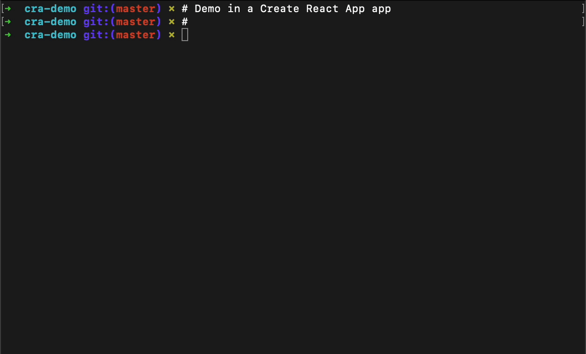

# setup-msw

[](https://npm.im/setup-msw) [](https://npm.im/setup-msw)

CLI tool that sets up [Mock Service Worker (MSW)](https://mswjs.io/) for your project.



## Features

This package basically does https://mswjs.io/docs/getting-started for you and that's all.
It fits you better when you are adding msw to more projects.

## Usage

```bash
npx setup-msw
```

## License

MIT &copy; [Doma](https://doma.land)
